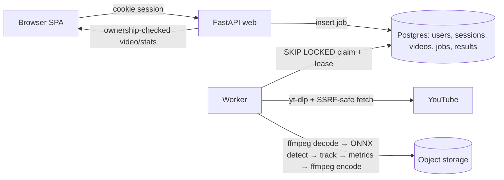

# ADR — Sports Play Analyzer

Status: Accepted · Date: <date> · Author: <name>

## 1. Context
Coach submits ≤60 s football/basketball clip (upload ≤100 MB or YouTube URL) → tactical stats +
annotated video. Constraints: ≈10 h effort, free/cheap host, pretrained models only, security
requirements (OAuth PKCE, SSRF, per-user isolation).

## 2. Architecture

Data flow: submit → validate → store source → job `queued` (202) → worker claims → fetch (URL) →
probe → stream frames → detect/track/metrics → encode → persist in one transaction → `succeeded`.

## 3. Key decisions
| Topic | Decision | Why | Trade-off |
|---|---|---|---|
| Model | | accuracy / speed / cost / licence | |
| Tracker | | | |
| Queue | Postgres SKIP LOCKED + lease | | |
| Sessions | Server-side, `__Host-sid` httpOnly Secure SameSite=Lax | | |
| Storage | | | |
| Host | | | |
| SSRF | allowlist + IP block + manual redirects + caps | | residual: DNS rebinding |
| YouTube blocking | clear `YOUTUBE_BLOCKED` error + upload fallback (+ optional cookies/proxy) | | |

## 4. Data model & indexes
Tables + FKs (1 line each). Index justification: `ix_jobs_claimable` … ; `ix_jobs_user_created` … .

## 5. Reliability
Idempotent retry (lease, attempts, single-transaction results, deterministic blob keys).
Error codes and how the UI shows them.

## 6. CI/CD & rollback
Pipeline steps. Rollback: redeploy previous immutable image sha (workflow), expand/contract migrations.

## 7. What I cut and why
-

## 8. With more time
-
