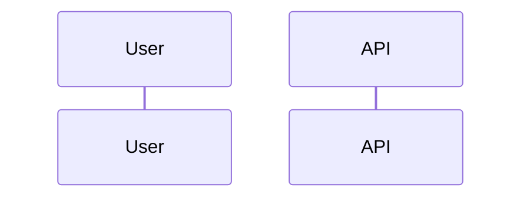

# Stage S-xx - <name>

**Dates:** <start> → <end> · **Hours:** <x.x> · **Tickets:** T-…, T-…

## What was built (plain English)
3–6 bullets a non-engineer could follow.

## How it works now (data flow for this stage)

## Key decisions (and why)
| ID | Decision | Why | Alternative rejected |
|---|---|---|---|

## How to demo / verify
Commands and clicks, with expected result.

## Tests added
file → what behaviour it proves.

## AI corrections during this stage
- (from devlog ⚠ entries; copy the best to AI_USAGE.md)

## Known gaps / tech debt
-

## Interview prep - questions you may get about this stage
1. Q: … A: …
2. Q: … A: …
3. Q: … A: …
