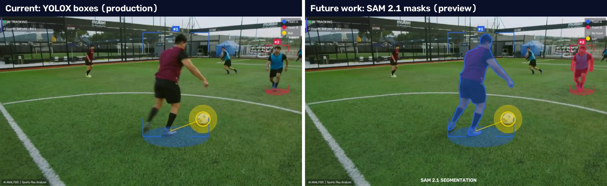

# Sports Play Analyzer

Upload a ≤60 s football/basketball clip or paste a YouTube link → player tracking, distance,
heatmaps, possession and an annotated video.

**Live:** `<url>`  ·  **ADR:** [docs/ADR.md](docs/ADR.md)  ·  **AI usage:** [AI_USAGE.md](AI_USAGE.md)

## Run locally (one command)
```bash
cp .env.example .env        # fill GOOGLE_CLIENT_ID/SECRET, SESSION_SECRET (see below)
docker compose up --build   # http://localhost:8000
```
Open **http://localhost:8000** (not `127.0.0.1`, Google matches the redirect URI exactly).
Without the three Google settings the app still runs, but "Continue with Google" shows
"sign-in is not available" (and the server log says which settings are missing).

### One-time Google sign-in setup
1. Google Cloud Console → *APIs & Services* → *OAuth consent screen*: External; app name; your
   email; scopes `openid`, `email`, `profile`. While it is in **Testing**, add your Google
   account under *Test users*. (For reviewers: **Publish app → In production**, T-102.)
2. *Credentials* → *Create credentials* → *OAuth client ID* → **Web application**:
   - Authorized JavaScript origin: `http://localhost:8000`
   - Authorized redirect URI: `http://localhost:8000/auth/callback`
   - (later, production: `https://<your-app>/auth/callback`, and set `APP_ORIGIN` to match)
3. Put the client ID and secret in `.env`, plus a random session secret:
   `python -c "import secrets; print(secrets.token_urlsafe(48))"` → `SESSION_SECRET=…`.
   `.env` is git-ignored; never commit it.

## Test
```bash
docker compose up -d db
pytest -q backend/tests -m "not integration and not model"
pytest -q backend/tests -m integration
cd frontend && npm ci && npm run lint && npm run typecheck && npm run build
```

## Manual YouTube fetch check
Edit `URL` at the top of `backend/scripts/fetch_check.py`, then `cd backend && python scripts/fetch_check.py`.
It runs the production fetch path (yt-dlp metadata → SSRF-guarded download → ffprobe) without a database.

## Deploy
Google Cloud, `asia-south1` (D-035). Merging to `main` runs `.github/workflows/cd.yml`:
build → Artifact Registry → Alembic migration (Cloud Run job) → Cloud Run service (web) +
Cloud Run worker pool (worker) → `/health` smoke test that checks the deployed git sha.
GitHub signs in to Google with Workload Identity Federation (no stored key); every secret
lives in Secret Manager. Rollback: Actions → Rollback → enter a previous commit sha (redeploys
that image, never runs migrations). First-time setup: see [docs/ADR.md](docs/ADR.md) §6.

**Storage note:** the `S3_*` settings name the storage *protocol*, not AWS. In production they
point at **Google Cloud Storage** (`S3_ENDPOINT_URL=https://storage.googleapis.com`,
`S3_REGION=auto`, HMAC keys from our Google project) through Cloud Storage's S3-compatible
XML API. No AWS account is involved.

### Refreshing the YouTube cookies (when URL jobs start failing with "YouTube blocked")
YouTube blocks Google Cloud's addresses unless the worker sends a signed-in session (D-036).
1. Chrome Incognito, signed in to the **throwaway** account only → open
   `https://www.youtube.com/robots.txt` in the same tab → export with *Get cookies.txt LOCALLY*
   (Netscape format) → close the window **without signing out**.
2. Store it (never paste the contents anywhere):
   `base64 -w0 www.youtube.com_cookies.txt | gcloud secrets versions add ytdlp-cookies-b64 --data-file=-`
3. Restart the worker so it reads the new version:
   `gcloud run worker-pools update sports-analyzer-worker --region=asia-south1 --update-secrets=YTDLP_COOKIES_B64=ytdlp-cookies-b64:latest`
4. Delete the local cookies file.

## Configuration
| Variable | Default | Meaning |
|---|---|---|
| `DATABASE_URL` | `postgresql://...` | Postgres connection string |
| `APP_ORIGIN` | `http://localhost:8000` | Public origin; OAuth redirect URI is `APP_ORIGIN/auth/callback` |
| `SESSION_SECRET` | `""` | Signs the short-lived `oauth_tx` cookie (OAuth state/nonce/PKCE); required in production |
| `GOOGLE_CLIENT_ID` | `""` | Google OAuth client ID; required in production (dev: login says "not configured") |
| `GOOGLE_CLIENT_SECRET` | `""` | Google OAuth client secret; required in production |
| `COOKIE_SECURE` | `true` | `true`: session cookie `__Host-sid` (Secure); `false` for local http: cookie `sid` |
| `SESSION_TTL_DAYS` | `7` | Session lifetime |
| `TRUSTED_ORIGINS` | `""` | Extra origins (comma-separated) allowed to send unsafe requests; e.g. Vite `http://localhost:5173` |
| `CORS_ORIGINS` | `""` | CORS stays off (same-origin SPA) unless exact origins are listed; `*` is refused |
| `CSP_MEDIA_ORIGINS` | `""` | Extra origins for video/thumbnails in the CSP (e.g. a CDN); the `S3_ENDPOINT_URL` origin is always allowed |
| `LEASE_SECONDS` | `60` | Worker lease on a claimed job, extended by heartbeats |
| `BLOB_BACKEND` | `local` | `local` (directory) or `s3` (any S3-compatible store; prod = Google Cloud Storage); production requires `s3` |
| `BLOB_LOCAL_DIR` | `<repo>/blobs` | Directory for `local` (Docker: `/app/blobs`) |
| `S3_ENDPOINT_URL` / `S3_BUCKET` / `S3_REGION` | `""` | S3-compatible storage; empty endpoint = AWS |
| `S3_ACCESS_KEY_ID` / `S3_SECRET_ACCESS_KEY` | `""` | Storage credentials (required for `s3`) |
| `SAMPLE_FPS` | `5` | Video decoding sample rate (frames/sec); the annotated video plays at this rate |
| `MAX_FRAME_SIDE` | `1280` | Decoded frames are scaled so the long side is at most this |
| `ENCODE_CRF` / `ENCODE_PRESET` | `26` / `veryfast` | libx264 quality and speed for the annotated video |
| `RATE_LIMIT_PER_MINUTE` / `RATE_LIMIT_PER_HOUR` | `10` / `30` | Submissions per user per minute / hour (429 + `Retry-After` beyond) |
| `MAX_ACTIVE_JOBS_PER_USER` | `3` | Jobs a user may have queued or processing at once (429 `TOO_MANY_ACTIVE_JOBS`) |
| `WORKER_POLL_SECONDS` | `2` | Idle worker polls the queue this often (±25 % jitter) |
| `HEARTBEAT_EVERY_FRAMES` | `10` | Worker extends its lease and reports progress every N sampled frames |
| `TEAM_SAMPLE_EVERY` / `TEAM_MAX_SAMPLES` | `5` / `20` | Jersey-colour sampling for the team split: every N frames, at most M per player |
| `MODEL_PATH` | `<repo>/models/yolox_s.onnx` | YOLOX-S ONNX weights (Docker: `/models/yolox_s.onnx`, sha256-checked at build) |
| `DETECT_INPUT_SIZE` | `640` | Square detector input (multiple of 32; must match the model file) |
| `BALL_CONF_THRESHOLD` | `0.15` | Minimum ball score; players are kept down to `TRACKER_LOW_THRESH` |
| `NMS_THRESHOLD` | `0.45` | IoU above which overlapping player boxes are merged |
| `DETECT_MAX_CANDIDATES` | `300` | Player boxes kept per frame before NMS (bounds CPU) |
| `ORT_THREADS` | `0` | ONNX Runtime CPU threads (0 = one per core) |
| `TRACKER_HIGH_THRESH` / `TRACKER_LOW_THRESH` | `0.5` / `0.1` | Detection scores that start/match tracks vs. only keep existing tracks alive (ByteTrack stage 2) |
| `TRACKER_IOU_THRESHOLD` / `TRACKER_LOW_IOU` | `0.3` / `0.5` | Minimum IoU for a match in stage 1 / stage 2 |
| `TRACKER_MAX_AGE` | `10` | Sampled frames a hidden player keeps their id (10 at 5 fps = 2 s) |
| `TRACKER_MIN_HITS` | `3` | Sightings before a track is confirmed and gets a player id |
| `MIN_BOX_AREA_REL` | `0.0005` | Ignore player boxes smaller than this fraction of the frame |
| `JITTER_PX` | `2.0` | Feet movements below this (pixels) are detector wobble, not distance |
| `HEATMAP_GRID_W` / `HEATMAP_GRID_H` | `32` / `18` | Heatmap grid size |
| `POSSESSION_DIST_RATIO` | `0.5` | Ball counts as at a player's feet within this × their box height |
| `POSSESSION_MIN_FRAMES` | `3` | Sampled frames in a row before possession changes hands |
| `TEAM_MIN_SEPARATION` | `0.2` | Jersey-colour clusters closer than this → all players `unknown` team |
| `MAX_VIDEO_DURATION_SECONDS` | `60` | Maximum allowed duration for processing |
| `MAX_UPLOAD_SIZE_BYTES` | `104857600` | Maximum upload size (100 MB); enforced before and while the body is read |
| `UPLOAD_TMP_DIR` | system temp | Parent dir for per-request upload temp dirs (always removed) |
| `YTDLP_COOKIES_B64` | `""` | Optional: base64 cookies.txt (throwaway account) if YouTube blocks the server, secret. Production: Secret Manager `ytdlp-cookies-b64`, worker only (D-036) |
| `YTDLP_PROXY` | `""` | Optional: proxy for yt-dlp and the media download |

## API
`GET /auth/login`, `GET /auth/callback`, `POST /auth/logout`, `GET /api/me`,
`POST /api/jobs/upload`, `POST /api/jobs/url`, `GET /api/jobs`, `GET /api/jobs/{id}`,
`GET /api/jobs/{id}/stats`, `GET /api/jobs/{id}/players/{pid}`, `GET /api/jobs/{id}/video`, `GET /health`

## Future work: SAM 2 segmentation (not deployed)
A feasibility spike (D-040, D-041) ran Meta's **SAM 2.1 tiny** on top of our pipeline: each player
box from YOLOX + our tracker is used as a prompt, and SAM 2 returns the player's exact outline.
The masks are clearly better than boxes, but on our CPU worker SAM 2 is far too slow, so it is
**not part of the deployed app**. It is planned as an optional second "refine" pass.

[](docs/media/sam2-demo.mp4)

Demo: [docs/media/sam2-demo.mp4](docs/media/sam2-demo.mp4) (8 s, 1280×720, 5 fps; the owner's
test clip with the production overlay plus SAM 2 masks in team colours). Source footage: a free
Mixkit stock clip ("Goal play in a semi-professional soccer game").

**What it would improve:** team colours sampled from the player's own pixels (not a box that is
half grass), a more accurate feet point for distance and heatmaps, and a mask outline in the
annotated video.
**What it does not fix:** SAM 2 in image mode only outlines players the detector already found;
following players YOLOX misses needs SAM 2's video mode, which is the slowest.

**Measured on CPU** (owner's 8 s clip, 41 sampled frames, 1280×720; 2 threads ≈ our 2 vCPU worker):

| | Per frame | 60 s clip at 5 fps (300 frames) |
|---|---|---|
| Current pipeline (YOLOX + tracker + render) | ~0.3 s | ~1.5 min |
| SAM 2 image mode, every frame | ~12 s (10.7 s encoder + 1.5 s masks) | ~60 min |
| SAM 2 image mode, 1 keyframe per second | ~12 s | ~12 min |
| SAM 2 video mode (tracks through frames) | ~62 s (6 players) | ~5 h |

With 4 threads the encoder takes 6.7 s per frame; the whole 8 s demo took 115 s of SAM 2 time.

### Resources needed to run the SAM 2 version
| Resource | Requirement |
|---|---|
| Model | SAM 2.1 hiera-tiny checkpoint `sam2.1_hiera_tiny.pt`, 156 MB, sha256 `7402e0d864fa82708a20fbd15bc84245c2f26dff0eb43a4b5b93452deb34be69` (Apache-2.0); download in the Docker build and verify like YOLOX |
| Python packages | `torch` and `torchvision` (CPU builds used: 2.14.1 / 0.29.1 from the PyTorch CPU index), `sam2` pinned to commit `2b90b9f5ceec907a1c18123530e92e794ad901a4` (installed from GitHub; no PyPI release used), Python 3.12 |
| Image size | PyTorch adds several hundred MB to the image (estimated 700 MB to 1 GB, not measured) + the 156 MB checkpoint. Exporting to ONNX Runtime would avoid PyTorch entirely |
| Memory | Plan for a 4 GiB worker for SAM 2 (peak not measured; the current worker has 2 GiB) |
| Compute, CPU only | Minutes per clip at best (keyframes); not viable per frame. Next step: ONNX + int8 export of the encoder/decoder (expected 2 to 4× faster, not measured) or a lighter model such as EdgeTAM / EfficientTAM (speed and licence to check) |
| Compute, GPU | The normal way to run SAM 2. Cloud Run supports NVIDIA L4 GPUs on worker pools, but GPUs are not available on a Google Cloud free-trial billing account; the account must be upgraded. GPU speed not measured here |
| CPU patch | SAM 2's video predictor stores its memory in bfloat16, which fails on CPU (`mat1 and mat2 must have the same dtype`); keep it in float32 when running on CPU |

### How it would be built
1. A **separate worker pool** for SAM 2, so the normal job queue never waits behind it.
2. Jobs finish as today with the fast YOLOX results, then get a new stage, **"Refining with SAM 2…"**;
   the results page shows the early results and swaps in the refined video and stats when ready.
3. A database migration for the second result version and its status (refining / refined / failed),
   with the early results kept if refinement fails.
4. Keyframes only (about 1 per second), with masks carried to the frames in between.

The spike scripts, the PyTorch environment and the checkpoint were kept outside the repo; only
this summary, the demo video and the comparison image are committed.

## Session log
| # | Start (IST) | End (IST) | Duration | What I did |
|---|---|---|---|---|
| 1 | 2026-09-30 00:50 | 2026-09-30 01:20 | 0 h 30 m | S0 kickoff, repo scaffold, doc skeletons, tooling checks |
| 2 | 2026-09-30 22:21 | (open) | | |

Total: 0 h 30 m
