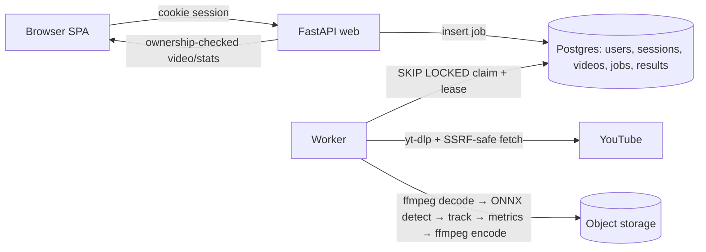

# ADR — Sports Play Analyzer

Status: Proposed · Date: 2026-09-30 · Author: Antigravity & User

## 1. Context
Coach submits ≤60 s football/basketball clip (upload ≤100 MB or YouTube URL) → tactical stats +
annotated video. Constraints: ≈10 h effort, free/cheap host, pretrained models only, security
requirements (OAuth PKCE, SSRF, per-user isolation).

## 2. Architecture

Data flow: submit → validate → store source → job `queued` (202) → worker claims → fetch (URL) →
probe → stream frames → detect/track/metrics → encode → persist in one transaction → `succeeded`.

## 3. Key decisions
| Topic | Decision | Why | Trade-off |
|---|---|---|---|
| Model | YOLOX-S ONNX on ONNX Runtime CPU; official release, sha256-checked in the Dockerfile; per-class person/ball scores (D-025) | Apache-2.0 (Ultralytics is AGPL-3.0), no PyTorch in the image, ~160 ms/frame on a laptop | Ball is small/fast → low recall, reported as ball-visible %; referees/crowd count as "person" |
| Worker pass | One streamed pass: decode → detect → track → draw → encode, one frame in memory (D-026) | Memory flat regardless of clip length | Boxes coloured by player id, not team (teams known only after the pass) |
| Tracker | ByteTrack-style pure Python (numpy + scipy Hungarian, D-021) | Fast, pure maths, unit-testable with fixtures, no PyTorch needed | IoU only: ids can swap when identical kits cross or at low SAMPLE_FPS; hidden > `TRACKER_MAX_AGE` (2 s) → new id |
| Metrics | One pass over per-frame observations; feet point, jitter dead-band, possession with hysteresis (D-022) | Pure functions, each unit-tested with hand-built frames | Distances in pixels / frame diagonal, not metres (camera pans); possession = proximity, not touches |
| Teams | Jersey colour (HSV cone, torso crop) + deterministic 2-means; `unknown` when kits are too similar (D-023) | No training data, pure numpy, testable on synthetic frames | Referees/goalkeepers join the nearest team; similar kits → `unknown` |
| Queue | Postgres SKIP LOCKED + lease | Zero extra infra (Redis/RabbitMQ), ACID consistency with job records | DB polling load (mitigated by exponential/jittered backoff) |
| Sessions | Server-side `sessions` table, `__Host-sid` httpOnly Secure SameSite=Lax | Immediate revocation, immune to XSS token theft | DB query on authenticated requests (cached per-request) |
| Storage | BlobStore protocol: local disk (dev) / S3-compatible Tigris or R2 (prod) | Single abstraction, zero cloud lock-in | Presigned URL expiration handling |
| Read API & authz | Every read looks the job up with the session `user_id` first → 404 (never 403) for missing *or* foreign, then 409 if unfinished; video = 302 to ≤5-min presigned URL (S3) or Range streaming (local); `/jobs…` aliases + SPA under `/app/…` (D-028) | Other users can't even learn a job exists (A3); `<video>` can seek | Two URL prefixes to keep in sync (one router mounted twice) |
| Frontend | React SPA under `/app/…`; identity only via `GET /api/me` (httpOnly cookie, nothing in web storage); 2 s polling only while a job is active, paused in hidden tabs; canvas heatmaps; pure logic unit-tested with Vitest (D-029) | Same-origin, no tokens in JS; idle tabs cost nothing | Polling, not push (SSE is BONUS T-B03) |
| Host | Fly.io (web + worker process groups) + Neon Postgres | Free/cheap tier, process group separation in one image | Machine sleep / cold start latency |
| SSRF | Host allowlist + DNS IP validation + manual redirect checks | Protects internal networks & cloud metadata endpoints | Residual: DNS rebinding during multi-step hops |
| YouTube blocking | Graceful `YOUTUBE_BLOCKED` error + upload fallback | Datacenter IPs frequently challenged by YouTube anti-bot | User must upload file if cloud IP is blocked |

## 4. Data model & indexes
Source of truth: `backend/app/adapters/db_tables.py`; revision `0001`. UUID PKs, `timestamptz`, named constraints, children `ON DELETE CASCADE`.
- `users`: provider + provider_sub (unique), email, name, avatar_url.
- `sessions`: `token_hash` (sha256 of cookie, PK), user_id, expires_at (Index: `ix_sessions_user`).
- `videos`: user_id, source_type `upload|url` (url required iff `url`), storage_key, size/duration/width/height/fps.
- `jobs`: user_id NOT NULL, video_id, status `queued|processing|succeeded|failed`, progress 0–100, stage, error_code (required when failed) + message, attempts/max_attempts, locked_by, lease_expires_at, config JSONB (Indexes: partial `ix_jobs_claimable`, composite `ix_jobs_user_created`).
- `job_results`: job_id (PK/FK — one result per job), stats JSONB, annotated_key.
- `player_tracks`: PK (job_id, track_id) so retries replace rows; team `A|B|unknown`, distances, possession_frames, heatmap + track JSONB.
- Index justification with EXPLAIN evidence: decisions D-011.

## 5. Reliability
- Queue in Postgres (D-014): one-statement claim with `FOR UPDATE SKIP LOCKED`; 60 s lease extended by heartbeats; every write after claim is guarded by `locked_by`, so a worker that lost its lease writes nothing.
- Idempotent retry: `finish` is one transaction (`delete` tracks → `insert` → upsert result → `succeeded`) on natural keys.
- Crashes retry via lease expiry (≤3 attempts), then `sweep_dead` → `failed/WORKER_CRASHED`; no job stays `processing`.
- Final vs transient (D-026): bad input (`CORRUPT_FILE`, `DECODE_ERROR`, `YOUTUBE_BLOCKED`, `MODEL_ERROR`, …) fails at once with a readable message; storage/DB/encoder errors and bugs are re-raised so the lease lapses and the job is retried. A heartbeat or finish that finds the lease lost stops without writing.
- Worker loop (D-027): sweep → claim → process; idle polls jittered ±25 %; never dies on a job error or DB blip; SIGTERM finishes the current job; missing model → exit 1 before claiming.
- Granular error codes (`CORRUPT_FILE`, `DURATION_EXCEEDED`, `UNSUPPORTED_FORMAT`, `YOUTUBE_BLOCKED`, `DECODE_ERROR`).

## 6. CI/CD & rollback
- GitHub Actions CI (lint, test, build) on push/PR.
- CD on `main` merge: GHCR container build → Alembic migrate → deploy → `/health` check.
- Rollback: Manual workflow redeploying target immutable image tag.

## 7. What I cut and why
- Real-time video streaming (WebRTC) — unnecessary complexity for offline asynchronous tactical analysis.
- Live model fine-tuning — out of scope; pretrained COCO models satisfy player/ball detection.
- Deep appearance re-ID neural networks — too heavy for CPU worker constraints; ByteTrack + jersey color clustering satisfies requirement.

## 8. With more time
- Pitch-normalised distance via camera homography calibration (4 clicked pitch keypoints).
- Server-Sent Events (SSE) stream for live job progress.
- Multi-camera or multi-clip tactical timeline stitching.
