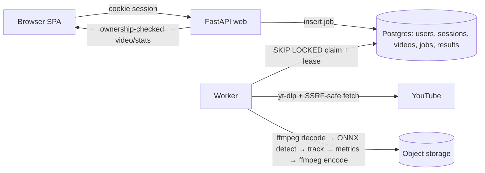

# ADR — Sports Play Analyzer

Status: Proposed · Date: 2026-09-30 · Author: Antigravity & User

## 1. Context
Coach submits ≤60 s football/basketball clip (upload ≤100 MB or YouTube URL) → tactical stats +
annotated video. Constraints: ≈10 h effort, free/cheap host, pretrained models only, security
requirements (OAuth PKCE, SSRF, per-user isolation).

## 2. Architecture

Data flow: submit → validate → store source → job `queued` (202) → worker claims → fetch (URL) →
probe → stream frames → detect/track/metrics → encode → persist in one transaction → `succeeded`.

## 3. Key decisions
| Topic | Decision | Why | Trade-off |
|---|---|---|---|
| Model | YOLOX-S ONNX (default) | Apache-2.0, CPU friendly, zero model training needed | Lower recall on crowded wide shots vs large models |
| Tracker | ByteTrack-style pure Python | Fast, pure maths, unit-testable with fixtures, no PyTorch needed | Sensitive to long occlusions without appearance re-ID |
| Queue | Postgres SKIP LOCKED + lease | Zero extra infra (Redis/RabbitMQ), ACID consistency with job records | DB polling load (mitigated by exponential/jittered backoff) |
| Sessions | Server-side `sessions` table, `__Host-sid` httpOnly Secure SameSite=Lax | Immediate revocation, immune to XSS token theft | DB query on authenticated requests (cached per-request) |
| Storage | BlobStore protocol: local disk (dev) / S3-compatible Tigris or R2 (prod) | Single abstraction, zero cloud lock-in | Presigned URL expiration handling |
| Host | Fly.io (web + worker process groups) + Neon Postgres | Free/cheap tier, process group separation in one image | Machine sleep / cold start latency |
| SSRF | Host allowlist + DNS IP validation + manual redirect checks | Protects internal networks & cloud metadata endpoints | Residual: DNS rebinding during multi-step hops |
| YouTube blocking | Graceful `YOUTUBE_BLOCKED` error + upload fallback | Datacenter IPs frequently challenged by YouTube anti-bot | User must upload file if cloud IP is blocked |

## 4. Data model & indexes
- `users`: Google sub, email, display name, created_at.
- `sessions`: hashed token, user_id, expires_at, created_at (Index: `ix_sessions_user`).
- `videos`: source_type (upload/url), source_path/url, duration_seconds, fps, width, height, user_id.
- `jobs`: status, attempts, lease_until, worker_id, progress, stage, error_code, user_id (Indexes: partial `ix_jobs_claimable`, composite `ix_jobs_user_created`).
- `job_results`: job_id (PK/FK), stats JSON, video_blob_key, created_at.
- `player_tracks`: job_id, player_id, team, jersey_color, positions JSON.

## 5. Reliability
- Idempotent worker retry via transactional result writes (`delete` -> `insert` -> `status=succeeded`).
- Lease heartbeat prevents orphan jobs if worker crashes.
- Granular error codes (`CORRUPT_FILE`, `DURATION_EXCEEDED`, `UNSUPPORTED_FORMAT`, `YOUTUBE_BLOCKED`, `DECODE_ERROR`).

## 6. CI/CD & rollback
- GitHub Actions CI (lint, test, build) on push/PR.
- CD on `main` merge: GHCR container build → Alembic migrate → deploy → `/health` check.
- Rollback: Manual workflow redeploying target immutable image tag.

## 7. What I cut and why
- Real-time video streaming (WebRTC) — unnecessary complexity for offline asynchronous tactical analysis.
- Live model fine-tuning — out of scope; pretrained COCO models satisfy player/ball detection.
- Deep appearance re-ID neural networks — too heavy for CPU worker constraints; ByteTrack + jersey color clustering satisfies requirement.

## 8. With more time
- Pitch-normalised distance via camera homography calibration (4 clicked pitch keypoints).
- Server-Sent Events (SSE) stream for live job progress.
- Multi-camera or multi-clip tactical timeline stitching.
