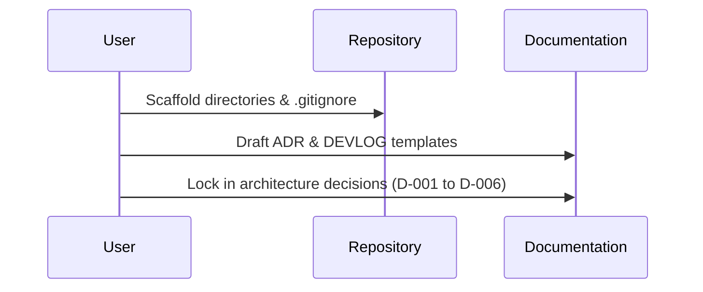

# Stage S00 - Kickoff & decisions

**Dates:** 2026-09-30 → 2026-09-30 · **Hours:** 0.5 · **Tickets:** T-001, T-002

## What was built (plain English)
- Initialized the Git repository and defined the branching strategy.
- Created the project directory structure following standard layouts (backend, frontend, GitHub workflows).
- Populated the mandatory documentation skeletons (README, ADR, AI_USAGE, TICKETS).
- Finalized and recorded the 6 core architecture decisions (model, hosting, sessions, routing, authentication, and polling).

## How it works now (data flow for this stage)

## Key decisions (and why)
| ID | Decision | Why | Alternative rejected |
|---|---|---|---|
| D-001 | YOLOX-S ONNX model | Clean Apache-2.0 license, fast on CPU without PyTorch. | Ultralytics YOLO (AGPL-3.0) |
| D-002 | Fly.io + Neon + Tigris | Supports separated web/worker process groups; free/cheap storage. | Render / VPS |
| D-003 | Server-side Postgres sessions | Immediate revocation on logout, immune to XSS token theft. | Stateless JWTs |
| D-004 | `/api/jobs/...` and `/jobs/...` aliases | Clean Vite SPA proxying while fulfilling backend requirements. | Strict `/jobs/...` only |
| D-005 | Google OAuth + PKCE | Fulfills requirement directly with a vetted standard. | Custom username/password |
| D-006 | Client-side 2s polling | Simplest, stateless, robust across restarts. | WebSockets / SSE |

## How to demo / verify
- Run `ls` to see the folder layout.
- Open `docs/ADR.md` and `docs/decisions.md` to see the architecture choices.

## Tests added
N/A (Project scaffold only)

## AI corrections during this stage
- None so far.

## Known gaps / tech debt
- `docker` and `ffmpeg` are missing from the local environment; need to be installed before building the worker pipeline.

## Interview prep - questions you may get about this stage
1. Q: Why did you pick YOLOX instead of standard YOLOv8?
   A: YOLOv8 has an AGPL license, which can limit commercial usage. YOLOX provides similar speed on CPUs and is under a clean Apache-2.0 license.
2. Q: Why use server-side sessions instead of JWTs for a React app?
   A: The assignment explicitly requires "Secure session handling." Server-side sessions allow immediate revocation (e.g., logging out actually invalidates the session), which stateless JWTs lack, and using `httpOnly` cookies protects against XSS.
3. Q: How does your folder structure separate concerns?
   A: We use a hexagonal/layered pattern in `backend/app/` with `core` (pure domain logic), `adapters` (I/O, database, models), and `entrypoints` (FastAPI routes, worker loops) clearly split from the `frontend`.
