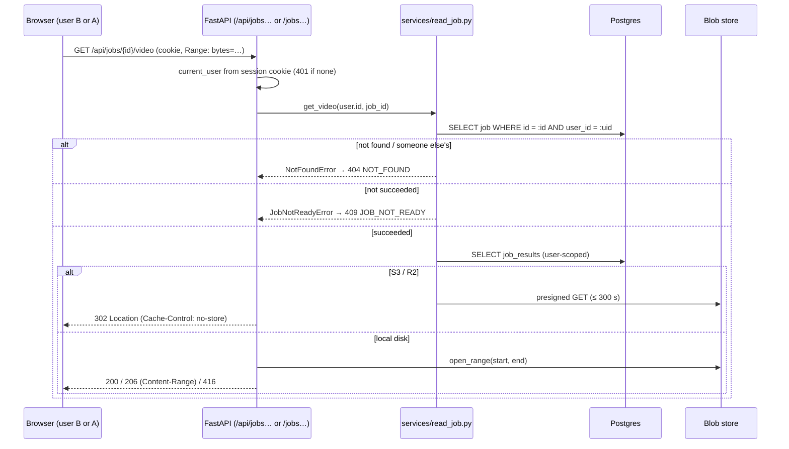

# Stage S7 - Read API

**Dates:** 2026-10-02 12:45 → 13:02 IST · **Hours:** not tracked separately (session 2 log still open, see README) · **Tickets:** T-070, T-071

## What was built (plain English)
- A coach can now read back everything the worker produced: the list of their jobs, one job's
  status and progress, the stats, one player's details and heatmap, team heatmaps, and the
  annotated video.
- The video can be scrubbed in the browser: the server answers "give me bytes X–Y" requests
  (HTTP Range), or, on cloud storage, hands the browser a link that expires within 5 minutes.
- The brief's short URLs (`/jobs/{id}`, `/jobs/{id}/stats`, …) work exactly like the
  `/api/jobs/…` ones. The React pages will live under `/app/…` so they never clash.
- Another user's job looks exactly like a job that doesn't exist: always 404, on every URL;
  this is scenario A3, and there is a test that proves it and was shown to fail when the user
  filter is removed.

## How it works now (data flow for this stage)

## Key decisions (and why)
| ID | Decision | Why | Alternative rejected |
|---|---|---|---|
| D-028 | Ownership check (404) **before** readiness check (409) | B must not learn that A's unfinished job exists | Readiness first (B would see 409 = "exists") |
| D-028 | 404, never 403, for foreign jobs | 403 confirms the id is real | 403 |
| D-028 | S3 → 302 to presigned URL; local → Range streaming | Bytes don't go through the web machine in prod; `<video>` seeks locally | Always stream through the API |
| D-028 | One router mounted at `/api/jobs…` and `/jobs…`; SPA under `/app/…` (owner's choice) | Brief's curl paths work; page refresh never returns JSON | Drop aliases / SPA at `/jobs/…` |
| D-028 | Single-range only; malformed/multi-range ignored | Browsers send one range; RFC 9110 allows ignoring | Multipart byteranges |

## How to demo / verify
- Local, no DB: `cd backend && pytest -q -k "http_range or read_api or user_b_cannot"` → 72 passed
  (Postgres cases skip).
- CI: `pytest -q -m integration -k "api_read or user_b_cannot"` (first real run, Docker deferred).
- With the app running (Docker pass / deploy): log in as A, submit, wait for `succeeded`, then
  `GET /jobs/{id}`, `/jobs/{id}/stats`, `/jobs/{id}/players/1`; open `/api/jobs/{id}/video` and
  seek. Log in as B in a private window → every one of those URLs is 404.

## Tests added
- `tests/unit/test_http_range.py` → Range parsing: open/closed/suffix ranges, clamping, 416 cases,
  malformed/multi-range ignored (19).
- `tests/unit/test_read_api.py` → list/detail shapes, 409 before success, 404 envelope, player and
  heatmap payloads, video 200/206/416, S3 302 ≤ 300 s, login required, aliases hidden from
  OpenAPI (26).
- `tests/unit/test_authz_matrix.py` → A-vs-B matrix over user-scoped fakes (27).
- `tests/integration/test_api_read.py` → the same reads against Postgres with a job that went
  through the real queue (3, CI).
- `tests/integration/test_authz_user_b_cannot.py` → required A3 test against Postgres: every
  endpoint × both prefixes, queued job indistinguishable from a random id, list isolation (26, CI).

## AI corrections during this stage
- The design checker flagged `JobDetail(JobSummary)` schema inheritance (house rule) → fields
  spelled out.
- A no-op assertion (`x | {} == x`) in the list test was caught in self-review and removed.
- Honest limit recorded: removing only the results-table `user_id` filter is not observable via
  the API (the job-ownership check runs first); it is covered by T-021's repository test.

## Known gaps / tech debt
- Postgres tests for this stage have **not run locally** yet (CI first; Docker pass later),
  including re-running the user-filter mutation against the real SQL repos.
- Browser seek of the annotated video not yet checked in a real `<video>` element (T-083).
- `?team=` validation errors use FastAPI's default 422 body, not our envelope (F-006 → T-091).
- No rate limiting on reads yet (T-090 covers submit endpoints).

## Interview prep - questions you may get about this stage
1. **Q:** Why does user B get 404 rather than 403 for A's job?
   **A:** 403 would confirm the id exists. Every read calls `JobRepo.get(user_id, job_id)`
   (`backend/app/services/read_job.py::_own_job`), whose SQL has `WHERE user_id = :uid`, so
   "not yours" and "doesn't exist" are the same `None` → `NotFoundError`.
2. **Q:** A's job is still processing, what does B see on `/stats`?
   **A:** 404, identical to a random id. Ownership is checked before readiness; only the owner
   gets `409 JOB_NOT_READY` (`tests/integration/test_authz_user_b_cannot.py::
   test_user_b_cannot_tell_user_a_queued_job_from_a_missing_one`).
3. **Q:** How does the video seek in the browser?
   **A:** Locally the API honours `Range: bytes=a-b` and answers 206 with `Content-Range`
   (`backend/app/core/http_range.py`, `entrypoints/api.py::video_response`). On S3/R2 it
   redirects (302) to a presigned URL valid ≤ 300 s, and the storage service handles Range.
4. **Q:** How do you know the authorization test would catch a regression?
   **A:** Mutation check: with the `user_id` filter removed from the job lookup, 14 cases fail;
   from the list query, 2 fail. A results-only removal is masked by the job check (defence in
   depth) and caught by `tests/integration/test_repos.py::test_other_user_cannot_read_job_video_or_results`.
5. **Q:** Why both `/api/jobs/…` and `/jobs/…`?
   **A:** The brief's examples use `/jobs/…`; the SPA uses `/api/…`. One FastAPI router is
   mounted twice with the same `current_user` dependency, aliases hidden from OpenAPI; React
   pages live under `/app/…` so a refresh never returns JSON (D-004, D-028).
