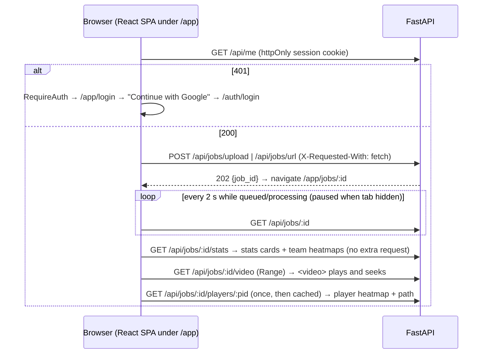

# Stage S8 — Frontend

**Dates:** 2026-10-02 13:10 → 13:37 IST · **Hours:** not tracked separately (session 2 log still open — see README) · **Tickets:** T-080, T-081, T-082, T-083, T-084 (+ fix for T-080 logout)

## What was built (plain English)
- A login page with one "Continue with Google" button; every other page needs a session and
  sends logged-out visitors back to it. Logging out always works, even if the server call fails.
- A "New analysis" page: upload a file or paste a YouTube link. The browser checks size and
  length first; if the server rejects the file (e.g. corrupt — scenario A2) its exact message
  appears under the form.
- A live list of your analyses with status chips and progress bars that update every two
  seconds while something is running — and stop asking the server once everything is finished.
- A job page: progress while it runs; a clear failure banner with the next step (for a YouTube
  block: "Upload the file instead"); when done, the annotated video (seekable), four headline
  stats and an interactive heatmap for everyone, Team A, Team B or any single player, with that
  player's path drawn on top.
- Someone else's job shows "Job not found" — the same as a job that doesn't exist (scenario A3).

## How it works now (data flow for this stage)

## Key decisions (and why)
| ID | Decision | Why | Alternative rejected |
|---|---|---|---|
| D-028/D-029 | Pages under `/app/…` | `/jobs/…` are API aliases from the brief; a refresh must never return JSON | SPA at `/jobs/…` |
| D-029 | Who-am-I only via `GET /api/me`; nothing in local/sessionStorage | Session cookie is httpOnly — XSS can't steal it | Token in localStorage |
| D-029 | Pure logic in `src/logic/` + Vitest 3.2.7 in CI (owner-approved) | Fast tests without a DOM; components stay thin | jsdom component tests (extra deps) |
| D-029 | Poll 2 s *after* each response, only while active, paused when hidden | No overlapping requests, no load from idle tabs | Fixed `setInterval` |
| D-029 | Team heatmaps from stats; player heatmap fetched once and cached | Switches redraw in 41–125 ms | Fetch on every switch |

## How to demo / verify
- `cd frontend && npm run lint && npm run typecheck && npm test && npm run build` → 43 tests pass.
- Locally without Postgres: the scratchpad preview server (real FastAPI + built SPA over
  `tests/api_fakes.py`, set cookie `sid=token-alice`) — see DEVLOG T-084 for the full walkthrough.
- With the stack running (Docker pass / deploy): log in → New analysis → paste a YouTube link →
  watch progress → video plays and seeks → pick a player in "Show heatmap for". Upload a
  corrupt file → message under the form. Second Google account → open the first job's URL →
  "Job not found".

## Tests added
- `src/api.test.ts` → CSRF header + same-origin cookies, envelope → `ApiError` with the server's message, friendly 429, 204, logout is POST, ids escaped.
- `src/logic/login.test.ts` → only known `?error=` codes become text (never echoes the query).
- `src/logic/precheck.test.ts` → size/empty/type/duration/link pre-checks; unknown MIME allowed through.
- `src/logic/poller.test.ts` → interval, no overlap, retry after failure, stop is final, pause while hidden + immediate refresh.
- `src/logic/jobs.test.ts` → active statuses, labels.
- `src/logic/results.test.ts` → failure headlines + next step (YOUTUBE_BLOCKED → upload), stats summary.
- `src/logic/heatmap.test.ts` → cell geometry, colour ramp, track points, selector options, selection parsing.
- `src/logic/session.test.ts` → logout clears local state even when the request fails (regression).

## AI corrections during this stage
- `src/lib/` silently ignored by the root `.gitignore` → renamed `src/logic/`, unpushed commit amended (AI_USAGE #10).
- Earlier advice to un-ignore `.claude/` was wrong (the repo tracks `.agent/`); CI change staged on HEAD's file only (AI_USAGE #10).
- Logout didn't survive a failing request; muddy heatmap colours; over-tall canvas — found only in the browser walkthrough (AI_USAGE #11).

## Known gaps / tech debt
- Real Google login, a real worker run and live progress during processing are untested end to end (need Postgres → Docker pass / deploy).
- The jobs table shows a short id, not the filename (list API has no video info — F-009).
- Boxes in the annotated video are coloured by player id, not team (D-026).
- Dev-tool npm advisories (Vite 5 / Vitest 3; production deps clean) — F-008.
- No upload progress bar (BONUS T-B02).

## Interview prep — questions you may get about this stage
1. **Q:** Where is the session token stored in the browser?
   **A:** Nowhere the page can read: it's the httpOnly `__Host-sid` cookie. The SPA asks `GET /api/me` who is logged in (`frontend/src/auth.tsx`); nothing goes into local/sessionStorage.
2. **Q:** How does the job list update without hammering the server?
   **A:** `frontend/src/logic/poller.ts` waits 2 s after each response (never overlapping), keeps going after errors, stops while `document.hidden`, and `JobsPage` only enables it while a job is queued/processing.
3. **Q:** What does user B see on user A's job page?
   **A:** "Job not found" — the API returns 404 for missing and foreign jobs alike (`services/read_job.py::_own_job`), and `JobDetailPage` maps 404 to `NotFoundPage`.
4. **Q:** How is the heatmap drawn and why is switching fast?
   **A:** `HeatmapCanvas.tsx` draws a neutral pitch then each grid cell from `logic/heatmap.ts::cellRects` with a yellow→red ramp; team maps come with the stats (no request) and a player's map is fetched once and cached — 41–125 ms per switch in the walkthrough.
5. **Q:** What happens if the logout request fails?
   **A:** `logic/session.ts::signOut` still clears local state and shows the login page; the server session expires on its own. That bug was found in the browser walkthrough and has a regression test.
