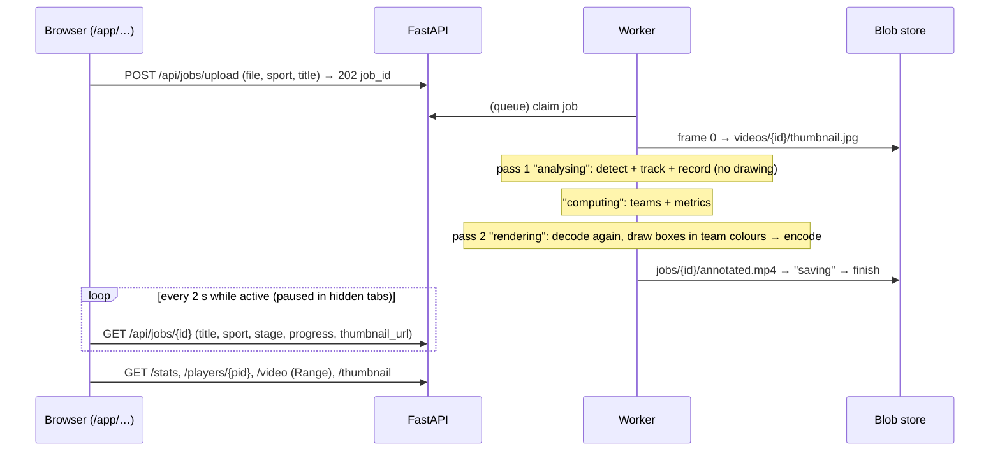

# Stage S8b - UI redesign (owner's brief)

**Dates:** 2026-10-02 13:55 → 15:00 IST · **Hours:** not tracked separately (session 2 log still open) · **Tickets:** T-085, T-086, T-087 (backend), T-088, T-089, T-094, T-095, T-096, T-097 (frontend)

## What was built (plain English)
- The backend now stores what the coach tells us (sport, optional title), reads every job together
  with its video (title, duration, size, sport, source), saves a thumbnail from the first frame,
  and draws the annotated video **after** splitting teams so boxes are blue (Team A) or red (Team B).
- Processing now has real, ordered steps the UI can show: queued → fetching (YouTube only) →
  analysing → computing → rendering → saving. The extra rendering pass costs about 2 % of the job.
- The app has a new look: a public landing page, a sign-in card, a sidebar shell (drawer on
  phones), a drag-and-drop New analysis page, a My videos list with filters and thumbnails, a
  processing page with a stepper, and a results page with tabs, a team legend, key metrics and
  smooth heatmaps drawn over a pitch or a court.
- Nothing on screen is invented: every number comes from the stats JSON or the player row; the
  legend lists only teams that exist; with no ball detected it says so instead of 0 %.

## How it works now (data flow for this stage)

## Key decisions (and why)
| ID | Decision | Why | Alternative rejected |
|---|---|---|---|
| D-030 | Fill backend gaps first, then the full brief | The UI must never fake data | Placeholders / dropping features |
| D-031 | Two passes (decode twice) | Team colours need the whole clip; buffering frames breaks "never hold the video in memory" | Single pass (no team colours), buffering |
| T-085 | Expand-only migration 0002 (sport default football, title ≤120, thumbnail key) | Old image still runs → rollback by image stays safe | Breaking column changes |
| T-086 | One JOIN for list/detail, `user_id` on both tables | No N+1; defence in depth for A3 | Per-row video lookups |
| D-029 | Pure `src/logic/*` + Vitest; heat rendered at 320 px then scaled | Fast, testable; switches stay well under 200 ms | Per-pixel canvas at full size |

## How to demo / verify
- `cd frontend && npm run lint && npm run typecheck && npm test && npm run build` → 72 tests.
- `cd backend && pytest -q -m "not integration and not model"` → 523 passed (1 Windows-only chmod failure, pre-existing); Postgres tests in CI.
- Click-through (preview server or the deployed app): `/` landing → `/login` → New analysis
  (drop a clip, pick sport, title) → processing stepper → results tabs → Player heatmaps (path toggle)
  → My videos filters → upload a corrupt file (server message) → second account opens the URL (Job not found).

## Tests added
- Backend: `test_submit_rules.py`, `test_submit_sport_title.py`, migration CHECK test, repo JOIN scoping,
  thumbnail endpoint + A3 matrix `/thumbnail`, `test_opencv_annotator.py` (team colours), process_job
  stage order / rendering with the final split / lease lost during rendering / thumbnail JPEG.
- Frontend: `format`, `user`, `videos`, `stepper`, `insights`, `smoothHeatmap` (incl. fade-in regression), API sport/title.

## AI corrections during this stage
- Assertions chained with `&&` silently never ran (lint + tsc caught it), AI_USAGE #12.
- Six visual issues found only in the browser walkthrough, AI_USAGE #13.
- Title test expectation (control characters become a space) and a test container without a prober (T-085 devlog).

## Known gaps / tech debt
- Postgres-backed tests for this stage are CI-only (Docker deferred); the real Google login is untested locally.
- Inter is loaded from Google Fonts → T-091's CSP must allow `fonts.googleapis.com` / `fonts.gstatic.com`.
- The time budget is exceeded (D-030); S9 security, S10 deploy and S11 live acceptance are still open.
- Distances remain in frame-relative units (no pitch calibration, BONUS T-B01).

## Interview prep - questions you may get about this stage
1. **Q:** Why does the worker decode the video twice?
   **A:** Teams are only known after seeing the whole clip, but frames are never kept in memory. Pass 1
   records boxes, pass 2 redraws them in team colours (`backend/app/services/process.py::_rendered_frames`).
   Measured: rendering 0.23 s vs analysing 10.34 s for 60 frames (D-031).
2. **Q:** How do you make sure the redesigned UI doesn't show invented numbers?
   **A:** It only renders fields from the API; `frontend/src/logic/insights.ts` reads stats as-is,
   `teamsPresent` hides empty teams, and the possession card says "ball not detected" when `ball_visible_pct` is 0.
3. **Q:** Where does the thumbnail come from and who can see it?
   **A:** The worker JPEG-encodes the first decoded frame to `videos/{video_id}/thumbnail.jpg`; it's served by
   `GET /api/jobs/{id}/thumbnail`, which runs the same ownership check as everything else, the A3 matrix includes it.
4. **Q:** How do the smooth heatmaps work?
   **A:** The backend keeps an integer grid; `logic/smoothHeatmap.ts` samples it bilinearly into a 320 px RGBA
   buffer with a blue→green→yellow→red ramp (alpha 0 at zero), the browser scales it up, and pitch or court lines
   are drawn on top based on the job's sport.
5. **Q:** Why is the new migration safe to roll back?
   **A:** It only adds columns with defaults/NULLs and checks, so the previous image keeps working against the
   upgraded schema; `downgrade()` drops exactly what it added.
