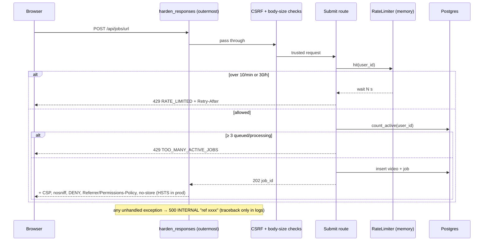

# Stage S-09 — Security hardening

**Dates:** 2026-10-02 → 2026-10-02 · **Hours:** inside session 2 (still open in the README session log) · **Tickets:** T-090, T-091, T-092 (+ follow-ups F-001, F-006 closed)

## What was built (plain English)
- A user can submit at most 10 videos a minute and 30 an hour. The 11th attempt gets a polite "try again in N s" with a `Retry-After` header.
- Nobody can have more than 3 videos waiting or processing at once, so one person can't block the single worker for everyone.
- Every page and API answer now carries browser security headers. A strict Content-Security-Policy only lets the page load our own scripts, Google Fonts and our storage host. Other sites can't frame us, and in production HTTPS is enforced.
- Every error, even an unexpected crash, comes back in the same `{"error": {code, message}}` shape. A crash shows only a reference id; the details stay in the server logs.
- Fixed a path-traversal hole in how the built frontend was served (`/..%2fsecret` could read files outside the folder).
- CI now scans the whole git history for leaked secrets on every push.

## How it works now (data flow for this stage)

## Key decisions (and why)
| ID | Decision | Why | Alternative rejected |
|---|---|---|---|
| D-032 | In-memory sliding-window limiter behind a `RateLimiter` port + SQL active-job cap, checked before any validation | One web machine; pure window maths unit-tested; refused attempts don't extend the block | slowapi (extra dependency); Postgres counter (BONUS T-B05) |
| D-033 | Pure header builder + one outermost function middleware that also catches crashes; CORS off by default; envelope for 422/404/405 | Headers on *every* response incl. 401/403/413/500; no `unsafe-inline` | `Exception` handler (Starlette answers it outside user middleware → 500 without headers); secure-headers library |
| D-034 | Plain gitleaks binary, pinned version + sha256, full history, `--redact` | Pinning rule; deleted secrets still caught; nothing leaks into public logs | gitleaks-action (licence for orgs, floating binary); pre-commit only (skippable) |

## How to demo / verify
- `cd backend && pytest -q -k "rate or headers"` → 40 passed.
- `curl -sI http://localhost:8000/health` → `content-security-policy`, `x-frame-options: DENY`, `x-content-type-options: nosniff`.
- Submit 11 URLs within a minute → the 11th returns `429 {"error":{"code":"RATE_LIMITED",…}}` with `Retry-After`.
- `curl -s -X POST …/api/jobs/url -d '{}'` (logged in) → `422 {"error":{"code":"VALIDATION_ERROR","message":"url: Field required"}}`.
- Browser: dashboard, job page, video, team heatmap → no CSP errors in the console (checked on the preview server).
- CI: the `secrets` job → "no leaks found".

## Tests added
- `tests/unit/test_rate_limit.py` → window maths (boundary expiry, retry-after), limiter per key, refused attempts not recorded, invalid limits rejected.
- `tests/unit/test_rate_limit_api.py` → 11th submit → 429 + Retry-After; `/api` and `/jobs` aliases share the count; per user; rejected submissions count; 4th active job → 429 and frees up.
- `tests/integration/test_repos.py::test_count_active_counts_only_this_users_queued_and_processing_jobs` → user-scoped SQL count (CI).
- `tests/unit/test_security_headers.py` → origins, CSP content, HSTS prod-only, no-store paths.
- `tests/unit/test_headers_api.py` → headers on health/SPA/API/401/403/video, CORS off/on/`*` refused, validation + 404/405 envelope, generic 500 with matching log ref, SPA traversal blocked.

## AI corrections during this stage
- F-001 path traversal in the AI-written SPA route; the regression test was proven to read the secret without the fix (AI_USAGE #14).
- First `no-store` rule forgot the `/jobs` aliases; crash test assumed `caplog` sees our non-propagating JSON logger.
- Window-boundary test expected a 60 s-old hit to still count (code treats it as expired, matching `Retry-After`).

## Known gaps / tech debt
- Rate-limit counts live in one web process (reset on restart; several web machines would each count separately) → BONUS T-B05.
- For uploads the limit runs after FastAPI has received the (≤ 100 MB) body; nothing is stored when refused.
- The `secrets` CI job and the `count_active` Postgres test run for the first time on the S9 PR.
- CSP `media-src` covers the S3 endpoint in both URL styles; a CDN needs `CSP_MEDIA_ORIGINS`. Verified only with local storage so far (S3 checked in S10 deploy).

## Interview prep — questions you may get about this stage
1. **Q: Why is the rate limiter in memory, not Redis?** A: One web machine and a ~10 h budget; the port (`core/ports.RateLimiter`) means a Postgres-backed version can replace `adapters/memory_rate_limiter.py` without touching routes. Restarts only make it more lenient.
2. **Q: How does your CSP allow React's inline styles without `unsafe-inline`?** A: React sets `style={{…}}` through the CSSOM (`element.style.x = …`), which CSP doesn't block; only `style="…"` in HTML markup and `<style>` blocks are blocked. Checked in the browser: 0 violations (`core/security_headers.py`).
3. **Q: Why catch exceptions in middleware instead of an `Exception` handler?** A: Starlette runs the generic 500 handler in `ServerErrorMiddleware`, outside our middleware, so that response would lose the security headers. `harden_responses` in `entrypoints/api.py` catches, logs the traceback with a ref, and returns the envelope.
4. **Q: Why is HSTS only in production?** A: It tells the browser to use HTTPS for a year; sending it from http://localhost would pin dev browsers to HTTPS and break local work.
5. **Q: What happens if a secret is committed?** A: The `secrets` CI job (gitleaks over full history, `fetch-depth: 0`) fails the build, even if a later commit deleted it. The fix is to rotate the secret; rewriting history is a last resort.
